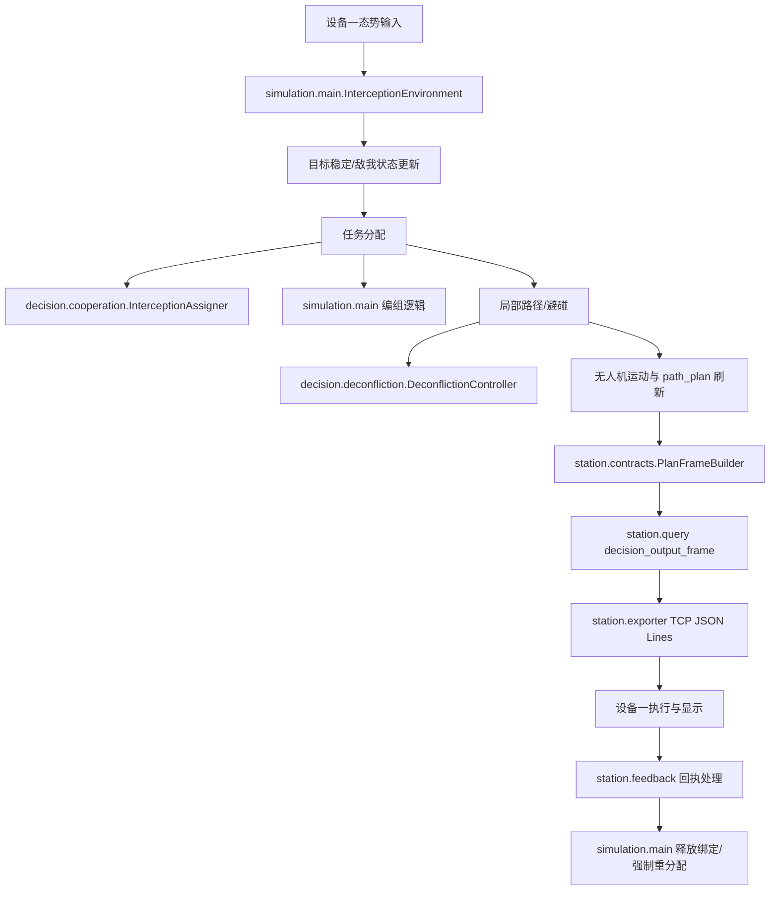

# UAV LLM 模块流程与接口化重构路线

最后更新：2026-07-14

## 参考原则

本次重构参考项目 `AGENTS.md`、`knowledge/design-principles.md`。落地时按以下顺序执行：

1. 先梳理真实运行流程，再改代码。
2. 保持单一职责：仿真、分配、路径、协议构造、传输、反馈处理分开。
3. 新增外部接口时扩展发布/转接端口，不改核心分配算法。
4. 对外只暴露调用方需要的最小接口。
5. 运行编排层依赖稳定端口，具体 TCP、Redis、旁路桥接作为可替换实现。

## 两设备边界

详细定义见 `knowledge/system-boundaries.md`。

- 设备一：雷达数据清理、当前战场态势输出、真实飞控执行和指挥大屏显示。
- 设备二：本仓库主体，接收设备一态势输入，完成任务分配、路径规划、动作建议和一句话态势总结，并回发决策帧。

## 当前主流程

## 模块职责边界

| 模块 | 当前职责 | 接口化边界 |
| --- | --- | --- |
| `simulation/main.py` | 主循环、环境状态、模式切换、任务刷新 | 只编排，不新增协议字段 |
| `decision/llm_task_constraints.py` | LLM/指挥员任务约束文本解析 | 纯解析模块，不修改 `env` |
| `core/common.py` | 仿真常量、枚举、实体字典工厂、运动工具和输出配置 | 保持稳定基础层，不依赖上层模块 |
| `decision/cooperation.py` | 撞击模式主拦截/随动分配 | 暴露分配结果，不关心外部协议 |
| `decision/deconfliction.py` | 局部避碰和路径修正 | 输出路径点，不发送外部消息 |
| `station/contracts.py` | 将 `env` 状态转换为完整 `PlanFrame` | 完整决策契约边界 |
| `station/query.py` | 从 `PlanFrame` 裁剪精简帧和查询视图 | 不重新分配、不重新规划 |
| `station/exporter.py` | 控制触发策略、组装载荷、分发、拉取回执 | 依赖发送端口/反馈端口 |
| `station/socket_client.py` | TCP JSON Lines 发送与回执收取 | 传输实现，不理解任务语义 |
| `station/feedback.py` | 解析 ACK/执行状态，必要时触发重分配 | 反馈处理端口，不构造 PlanFrame |
| `station/plan_bridge.py` | 历史旁路转接包 | 兼容/调试，不作为当前主链路 |

## 分阶段重构计划

### 阶段 1：决策输出触发方式对齐

目标：设备二每收到一次设备一态势输入，就对应回发一帧决策结果。

- `PLAN_EXPORT["publish_policy"] = "input_frame"`。
- `PlannerExporter` 使用 `env.last_live_packet_meta` 去重。
- `PLAN_EXPORT["output_frame_type"] = "decision_output_frame"`。
- `PlanFrame` 保留完整调试和扩展能力。

### 阶段 2：设备一消费视图稳定

目标：设备一优先消费 `decision_output_frame.commands[]`。

- `commands[]` 包含 `uav_id/drone_id`、`target_id`、`assignment_id`、`mission_type`、`role`、`actions`、`next_command_point`、`waypoints`。
- 绑定校验仍围绕 `assignment_id + uav_id + drone_id`。
- 现场确认 `uav_id_map`。

### 阶段 3：主环境内聚

目标：降低 `simulation/main.py` 超大类的修改风险。

- 按真实边界拆出小服务：命令解析、任务约束、模式调度、路径刷新候选。
- 每次只迁移一个无副作用函数族，并保留原调用入口。
- 不改 `integrations/middle_layer.py` / `integrations/redis_export.py` 既有显示接口。

### 阶段 4：历史命名清理

目标：在接口稳定后逐步清理历史 `设备3` 命名。

- 当前先保留 `station/`、`Device3FeedbackHandler`、`device3_*` 内部状态字段。
- 待联调稳定后再评估是否新增别名或迁移到 `output/`、`Device1FeedbackHandler` 等命名。
- 每次迁移必须保持协议语义可测。
